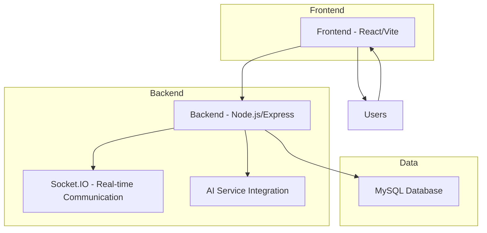

# Chatbot Platform Architecture

## Component Overview

### Frontend (React/Vite)
- Built with React and Vite for fast development
- Responsive UI with modern design
- Real-time chat interface using Socket.IO client
- User authentication and chatbot management

### Backend (Node.js/Express)
- RESTful API for user and chatbot management
- Socket.IO for real-time communication
- Prisma ORM for database operations
- JWT-based authentication
- AI service integration for chatbot responses

### Database (MySQL)
- User management
- Chatbot storage
- Conversation history
- Message storage

### Real-time Communication
- Socket.IO for instant message delivery
- Room-based conversation channels

### AI Integration
- Service layer for AI model interactions
- Response generation based on conversation history